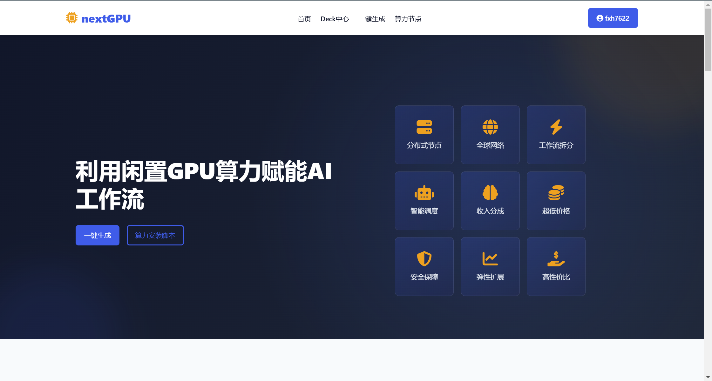
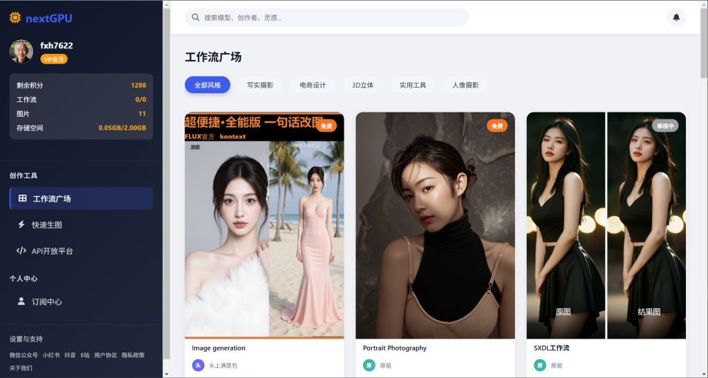
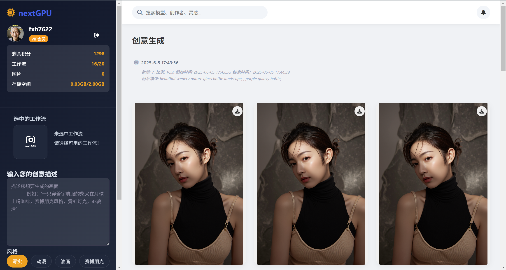

# nextGPU

## ng_website是nextGPU的网站源码
### index.html

### market.html
market.html页面是nextGPU提供comfyUI工作流（后续会继续增加）列表页面。用户进入market.html页面后，可以选中自己合适的工作流进行生成。

### generate.html
generate.html页面是nextGPU提供comfyUI功能的主要页面。用户可以进入generate.html页面，利用nextGPU提供的极简参数生成自己想要的结果。

